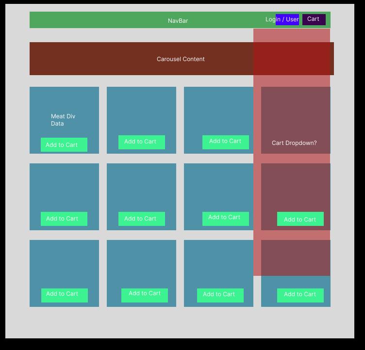
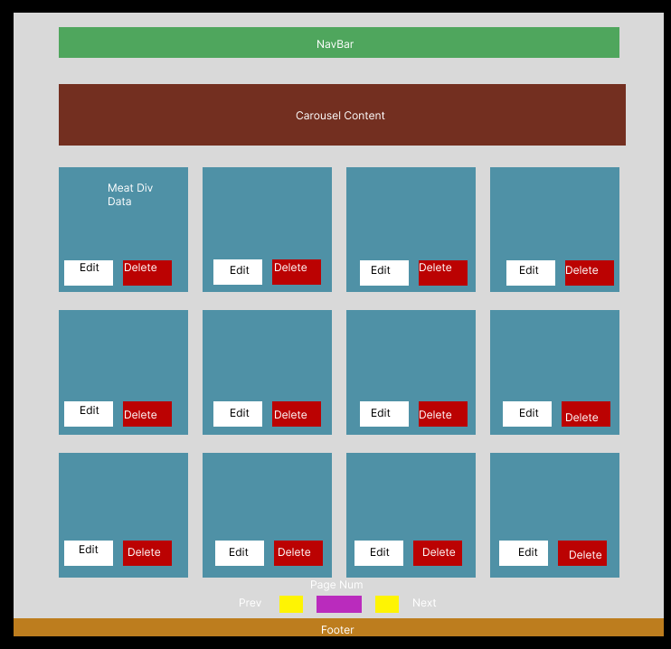
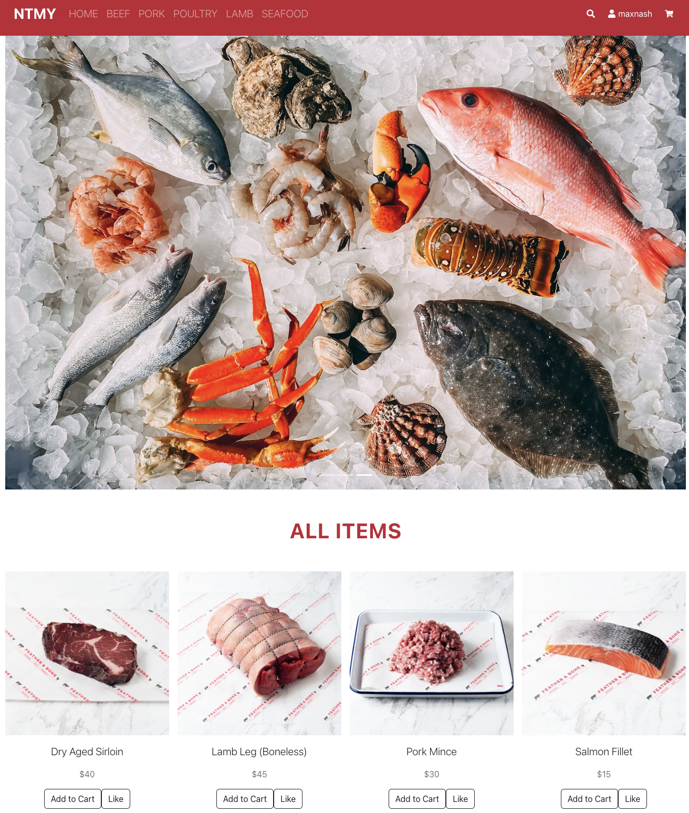

# Butcher Store React App

======Butcher Store Application========

-----Team & App:------

Nice to Meat you is your friendly online butcher providing quality meat products across Beef, Pork, Poultry, Lamb & Seafood.
Our theme was boiled down froma  few shared ideas around building out a retail/shopping based idea, testing the waters on an 'uber eats' style clone, and working with nested data structures across multiple categories. Overall we wanted something that would take our current knowledge and expand with new learning in things like Payment API, multiple layers of state and displaying nested datasets in a variety of ways.




A few future addition notes here: Pagination, we didn't reach critical mass on the provided data yet to warrant, but pagination is going to be the first thing added in the next feature release. We are also interested in a 'choose a store' section (for delivery, another future goal) that would integrate with the GoogleMaps API for locational based delivery service.

The Original MVP was to create a linked Database through to Backend and Frontend Routes, with major technology choices being MongoDB, Node.JS/Express/Mongoose and React.JS Hooks & Component based architecture. We used GitHub for managing our workflow process. Figma for some initial wireframing designs and Zoom/Discord/Slack for collaboratively messaging each other (mostly what files we were touching on so we didnt infinite merge conflict ourselves!).


------Installation instructions & requirements:------

A lot of our required packaging is in the package.json, so you should be able to ```npm i``` in the main 'ButcherStoreReactApp'
For hosting locally we recommend using Nodemon ```npm i nodemon``` for the server side (ButcherStoreReactApp) folder.

for the client side (client) folder once dependancies are installed you can boot with npm start.

we have strict ENV variables that are not included in this package, including a proxy port, you will need to reach out to an original creator to gain this material if you want to edit the source code.

------How to use the application------



The app itself is a shopping cart application that gives a user (defaulting to a 'guest' profile) the ability to browse a variety of meat, filter by category (beef, pork, etc) view more details on said items, like, add to cart, and process a purchase. There are some intricacies with the authenticated users having their own profile page which displays previously liked items and purchase history as well. We've also manually built an Admin profile to conditionally render a more editable selection of the 'for sale' items including a full edit and delete suite updated individual elements or the entire object, reducing stock or deleting an option completely, as well as the ability to add more selections if you are an administrator. 

All our data is hosted through MongoDB including User & product information.

To view product details simply click on a product image and it will take you to a page displaying more information.

To view your cart of items at any time the dropdown menu at the top right with the shopping cart icon will let you view and scroll through your current selected products, with a real time update on your subtotal.

Each subheading on the navigation bar will take you to a particular category of items, however if you can't find what you are searching for, the magnifying class symbol represents our search function which should be able to assist you further.

------This app was brought to you by:------

Jack Dyball: Backend, Payment and Database extraordinaire.  

Max Nash: Component man, figma monkey and Author.  

Gerald (Genfeng) Liu: StyleBot, Bootstrap and Array method powerhouse.  


